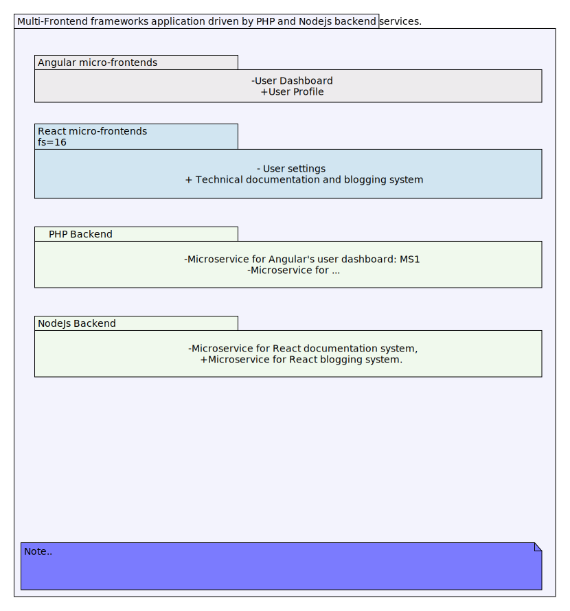

## Overview

In the development of web applications, striving for consistency across the user interface and simplifying state management is typically best achieved by employing a single framework. However, we have adopted a micro-frontend architecture, which allows us to utilize multiple frameworks by segmenting our application into independently built and deployed modules. This strategy provides the flexibility to choose the right technology for specific parts of the application based on unique requirements.

## How to Utilize Multiple Front-End Frameworks Through Micro-Frontends

Each segment of the application can be built and deployed independently. This allows us to utilize multiple frameworks by segmenting our application into independently built and deployed modules. This strategy provides the flexibility to choose the right technology for specific parts of the application based on unique requirements. Here is how we scaffold a micro-frontend architecture using Angular and React frontend frameworks driven by a PHP backend:

### System Components

The key components of our micro-frontend architecture are:

- Angular frontend: one or more micro-frontends can be built and deployed independently using Angular.
- React frontend: one or more micro-frontends can be built and deployed independently using React.
- PHP backend: the backend services that provide the data for the micro-frontends and let the user interact with them.
- Node backend: the backend services that provide the data for the micro-frontends and let the user interact with them.

